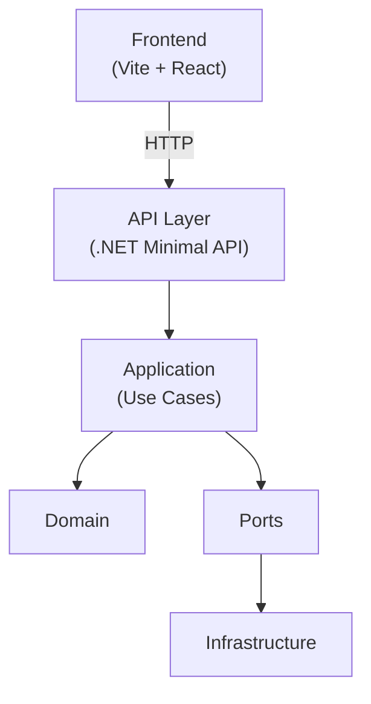
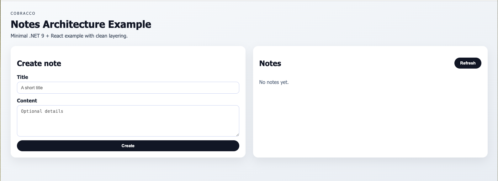

# Cobracco Architecture Example


A small reference project that showcases **how Cobracco designs software systems**:
clear boundaries, explicit dependencies, and decisions that scale over time.

This repository is not a framework and not a generic boilerplate.
It exists to demonstrate **structure, reasoning, and architectural discipline**.

---

## Stack
- **Backend**: .NET 9 — Minimal API
- **Frontend**: Vite + React (TypeScript)
- **Architecture**: Layered / Clean Architecture
- **API**: REST + OpenAPI (Swagger)

---

## Architecture at a glance

## Architecture at a glance



---

## Project structure

backend/
src/
Cobracco.ArchExample.Core/           # Domain + Application (stable)
Cobracco.ArchExample.Infrastructure/ # Implementations (replaceable)
Cobracco.ArchExample.Api/             # HTTP / delivery layer
tests/
frontend/
cobracco-arch-example-web/
docs/

---

## Architecture rules

- **Domain and Application do not depend on API or Infrastructure**
- Infrastructure implements **ports defined in Application**
- HTTP is a **delivery detail**, not the core of the system
- Business rules live in the **Domain**
- Dependencies always point **inwards**

---

## Example domain: Notes

The project includes a small “Notes” example to demonstrate:
- domain modeling
- use cases
- ports and adapters
- end-to-end flow (React → API → Application → Domain)

### Available endpoints
- `GET /api/notes`
- `POST /api/notes`

---

## Run locally

### Backend
```bash
cd backend
dotnet run --project src/Cobracco.ArchExample.Api --urls http://localhost:5000

Open:
	•	http://localhost:5000/swagger

Frontend

cd frontend/cobracco-arch-example-web
npm install
npm run dev

Open:
	•	http://localhost:5173

⸻

<<<<<<< HEAD
Testing approach

Domain logic is tested in isolation, without infrastructure dependencies.
Tests focus on behavior and invariants, not on frameworks.

⸻

Why this repository exists

This repository is meant to show how we think, not just how we code.

At Cobracco we prioritize:
	•	analysis before implementation
	•	architecture before features
	•	long-term maintainability over short-term speed

Software grows only if its foundations are solid.

⸻

Documentation
	•	Architecture overview: docs/architecture.md
	•	Architecture decisions: docs/decisions/

⸻

Contact

🌐 https://www.cobracco.it
💼 https://www.linkedin.com/company/cobracco

---

## ✅ Subito dopo il README
Consigliato (facoltativo ma molto efficace):
- aggiungi uno screenshot UI in `docs/images/ui.png`
- poi inserisci nel README:

```md
## Demo UI

=======
- ## Demo UI


## Links
- https://www.cobracco.it
- https://www.linkedin.com/company/cobracco
>>>>>>> 504683a0ca8fec1ae7f7b245dfac9e52cbfda32b
